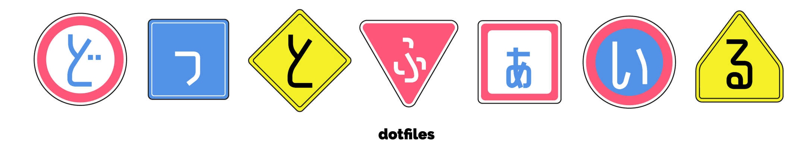

#+STARTUP: overview
#+TITLE: My literate dotfiles powered by org and Nix
#+AUTHOR: natsukium

** Install
*** for *nix
#+begin_src shell
sh -c "$(curl -fsSL git.io/dotnatsukium)"
#+end_src

*** for Windows
#+begin_src powershell
. { iwr -useb git.io/winnatsukium } | iex
#+end_src

*** for nix-on-droid
#+begin_src shell
nix-on-droid switch --flake github:natsukium/dotfiles/develop#default
#+end_src

** Nix flake
Build for macbook

#+begin_src shell
nix build .#darwinConfigurations.macbook.system
darwin-rebuild switch --flake .#macbook
#+end_src

Build for linux machine

#+begin_src shell
nix build --no-link .#homeConfigurations.x64-vm.activationPackage
home-manager switch --flake .#gazelle
#+end_src

Update packages

#+begin_src shell
nix flake update
#+end_src

** Modules
dotfilesで利用するNixのモジュールの定義
インターナルなモジュールのため、直接利用しないことを推奨します。
*** NixOS Modules
#+begin_src nix
nixosModules = import ./nix/modules/nixos;
#+end_src
nix/modules/nixos/以下にあるモジュールを読み込む
#+begin_src nix :tangle nix/modules/nixos/default.nix
{
  imports = (
    builtins.map (module: ./. + "/${module}") (
      builtins.filter (x: x != "default.nix") (builtins.attrNames (builtins.readDir ./.))
    )
  );
}
#+end_src
dualboot用のモジュール
NTFSのマウントのサポートと時刻の修正を行う
#+begin_src nix :tangle nix/modules/nixos/dualboot.nix
{
  config,
  lib,
  pkgs,
  ...
}:
with lib;
let
  cfg = config.dualboot;
in
{
  options = with types; {
    dualboot = {
      enable = mkEnableOption "Enable dualboot with Windows";
      ntfsSupport = mkOption {
        type = bool;
        default = true;
        description = ''
          Enable NTFS support in the kernel. This is required to read and write to NTFS partitions.
        '';
      };
      adjustClock = mkOption {
        type = bool;
        default = true;
        description = ''
          Set the hardware clock to local time. This is required for Windows to display the correct time.
        '';
      };
    };
  };

  config = mkIf cfg.enable {
    boot.supportedFilesystems = optionals cfg.ntfsSupport [ "ntfs" ];
    time.hardwareClockInLocalTime = cfg.adjustClock;
  };
}
#+end_src
#+begin_src nix :tangle nix/modules/nixos/nvidia.nix
{
  config,
  lib,
  pkgs,
  ...
}:
with lib;
let
  cfg = config.nvidia;
in
{
  options = with types; {
    nvidia = {
      enable = mkEnableOption "";

      cudaSupport = mkOption {
        type = bool;
        default = true;
        description = "";
      };
    };
  };

  config = mkIf cfg.enable {
    hardware.opengl = {
      enable = true;
      driSupport = true;
      driSupport32Bit = true;
    };

    hardware.nvidia = {
      modesetting.enable = true;
      powerManagement = false;
      open = false;
      nvidiaSettings = true;
      package = config.boot.kernelPackages.nvidiaPackages.stable;
    };

    nixpkgs.config.cudaSupport = cfg.cudaSupport;
  };
}
#+end_src
*** Home Manager Modules
nix/modules/home-manager以下にあるモジュールを読み込む。
#+begin_src nix :tangle nix/modules/home-manager/default.nix :exports none
{
  imports = (
    builtins.map (modules: ./. + "/${modules}") (
      builtins.filter (x: x != "default.nix") (builtins.attrNames (builtins.readDir ./.))
    )
  );
}
#+end_src

#+begin_src nix :tangle nix/modules/home-manager/colima.nix

#+end_src
*** Nix Darwin Modules
#+begin_src nix
darwinModules = import ./nix/modules/darwin;
#+end_src

#+begin_src nix :tangle nix/modules/darwin/default.nix :exports none
{
  imports = (
    builtins.map (module: ./. + "/${module}") (
      builtins.filter (x: x != "default.nix") (builtins.attrNames (builtins.readDir ./.))
    )
  );
}
#+end_src

バッテリーの充電を制限するbclmを設定するモジュール。
#+begin_src nix :tangle nix/modules/darwin/bclm.nix
{
  config,
  lib,
  pkgs,
  ...
}:
with lib;
let
  cfg = config.services.bclm;
in
{
  options = with types; {
    services.bclm = {
      enable = mkEnableOption "BCLM, utility to limit max battery charge";
      package = mkPackageOption pkgs "bclm" { };
      value = mkOption {
        type = types.str;
        default = if pkgs.stdenv.isAarch64 then "80" else "77";
        description = "Value to set for max battery charge";
      };
    };
  };

  config = mkIf cfg.enable {
    environment.systemPackages = [ cfg.package ];
    launchd.daemons.bclm = {
      serviceConfig = {
        ProgramArguments = [
          "${cfg.package}/bin/bclm"
          "write"
          cfg.value
        ];
        RunAtLoad = true;
      };
    };
  };
}
#+end_src

nix-darwinのdefaults.finderモジュールを拡張するモジュール。
#+begin_src nix :tangle nix/modules/darwin/finder.nix
{ config, lib, ... }:

with lib;

{
  options = {
    system.defaults.finder.FXRemoveOldTrashItems = mkOption {
      type = types.nullOr types.bool;
      default = null;
      description = lib.mdDoc ''
        Whether to remove trash items after a month. The default is false.
      '';
    };
  };
}
#+end_src
** Configuration
*** flake.nix

*** emacs
Home Manager用の設定ファイル
#+begin_src nix :tangle nix/applications/emacs/default.nix
{ pkgs, config, ... }:
let
  emacs = pkgs.emacsWithPackagesFromUsePackage {
    package =
      if pkgs.stdenv.isDarwin then
        config.nur.repos.natsukium.emacs-plus
      else
        pkgs.emacs.override { withPgtk = true; };
    config = ./init.el;
    extraEmacsPackages = epkgs: with epkgs; [ ];
  };
in
{
  programs.emacs = {
    enable = true;
    package = emacs;
  };

  xdg.configFile."emacs/init.el".source =
    config.lib.file.mkOutOfStoreSymlink
      "${config.programs.git.extraConfig.ghq.root}/github.com/natsukium/dotfiles/nix/applications/emacs/init.el";

  home.shellAliases = pkgs.lib.optionalAttrs pkgs.stdenv.isDarwin {
    emacs = "${config.programs.emacs.package}/Applications/Emacs.app/Contents/MacOS/Emacs";
  };
}
#+end_src

**** 装飾
#+begin_src elisp :tangle nix/applications/emacs/init.el
  (set-face-attribute 'default nil
                      :family "Liga HackGen Console NF"
                      :height 140)
  (tool-bar-mode -1)
  (scroll-bar-mode -1)
  (add-to-list 'default-frame-alist
  '(undecorated-round . t))
  (leaf doom-themes
    :ensure t
    :config
  (load-theme 'doom-nord :no-confirm))
#+end_src

**** magit
#+begin_src elisp :tangle nix/applications/emacs/init.el
  (leaf magit
    :ensure t
    :bind
    (("C-x g" . magit-status)))
#+end_src

**** その他
インデントにタブを使用しない。Makefileの編集時のみタブを使用する。
#+begin_src elisp :tangle nix/applications/emacs/init.el
  (setq-default indent-tabs-mode nil)
#+end_src

#+begin_src 
  (add-hook 'makefile-mode-hook
  (lambda
  ()
  (setq indent-tabs-mode t)))
#+end_src

#+begin_src elisp :tangle nix/applications/emacs/init.el
  (setq org-src-preserve-indentation t)
#+end_src

Org Tempoを有効化する。
https://orgmode.org/manual/Structure-Templates.html
#+begin_src elisp :tangle nix/applications/emacs/init.el
  (require 'org-tempo)
#+end_src

Org modeでコードブロックを実行する。
#+begin_src elisp :tangle nix/applications/emacs/init.el
  (org-babel-do-load-languages
   'org-babel-load-languages
   '((shell . t)))
#+end_src

**** 言語別の設定

***** Nix
#+begin_src elisp :tangle nix/applications/emacs/init.el
  (leaf nix-mode
    :ensure t
    :mode "\\.nix\\'")
#+end_src

*** shell.nix
dotfilesの編集に必要な環境を提供する。
#+begin_src nix :tangle shell.nix
{
  pkgs ? import <nixpkgs> { },
  nurpkgs ? import (builtins.fetchTarball "https://github.com/nix-community/NUR/archive/master.tar.gz"
    ) { inherit pkgs; },
}:
pkgs.mkShell {
  nativeBuildInputs = with pkgs; [
    flyctl
    nurpkgs.repos.natsukium.nixfmt
    pandoc
    shellcheck
    shfmt
    sops
    ssh-to-age
    terraform
  ];
  shellHook = "";
}
#+end_src

** Utilities
*** Makefile
#+begin_src makefile :tangle Makefile :exports none
.PHONY: install_nix uninstall_nix switch setup build build-all x86_64-linux aarch64-linux aarch64-darwin
#+end_src

NixのCLIとして[[https://github.com/maralorn/nix-output-monitor][nix-output-monitor]]を使用する。
interactiveに実行しない場合、MAKEFLAGSを利用して書き換えることができる。
#+begin_src makefile :tangle Makefile
NIX := nom
#+end_src

hostPlatformのシステムを決定し、フラグを設定する。
#+begin_src makefile :tangle Makefile
OS := $(shell uname -s)
ARCH := $(shell uname -m)

JOBS_X86_64-LINUX :=
JOBS_AARCH64-LINUX :=
JOBS_AARCH64-DARWIN :=

ifeq ($(OS),Linux)
	JOBS_AARCH64-DARWIN := -j0
	ifeq ($(ARCH),x86_64)
		SYSTEM := x86_64-linux
		JOBS_AARCH64-LINUX := -j0
	else ifeq ($(ARCH),aarch64)
		SYSTEM := aarch64-linux
		JOBS_X86_64-LINUX := -j0
	endif
else ifeq ($(OS),Darwin)
	SYSTEM := aarch64-darwin
	JOBS_X86_64-LINUX := -j0
	JOBS_AARCH64-LINUX := -j0
endif
#+end_src

メインターゲットとしてhostPlatformと同じシステムの構成をすべてビルドする。
build-allターゲットにより、分散ビルドを用いて全構成をビルドする。
#+begin_src makefile :tangle Makefile
build: $(SYSTEM)

build-all: x86_64-linux aarch64-linux aarch64-darwin
#+end_src

#+begin_src makefile :tangle Makefile
x86_64-linux:
	$(NIX) build --impure --no-link --show-trace --system x86_64-linux $(JOBS_X86_64-LINUX) \
		.#nixosConfigurations.arusha.config.system.build.toplevel \
		.#nixosConfigurations.kilimanjaro.config.system.build.toplevel \
		.#nixosConfigurations.manyara.config.system.build.toplevel \

aarch64-linux:
	$(NIX) build --impure --no-link --show-trace --system aarch64-linux $(JOBS_AARCH64-LINUX) \
		.#nixosConfigurations.serengeti.config.system.build.toplevel \

aarch64-darwin:
	$(NIX) build --no-link --show-trace --system aarch64-darwin $(JOBS_AARCH64-DARWIN) \
		.#darwinConfigurations.katavi.system \
		.#darwinConfigurations.mikumi.system \
		.#darwinConfigurations.work.system \
#+end_src

dotfilesをシステムに適用する。
#+begin_src makefile :tangle Makefile
switch: nix/home.nix
	home-manager -f nix/home.nix switch -b backup
#+end_src

Nixをdaemonモードでインストールする。
See more information: https://github.com/DeterminateSystems/nix-installer
#+begin_src makefile :tangle Makefile
NIX_PROFILE := /nix/var/nix/profiles/default/etc/profile.d/nix-daemon.sh

install_nix: $(NIX_PROFILE)

$(NIX_PROFILE):
	curl --proto '=https' --tlsv1.2 -sSf -L https://install.daeterminate.systems/nix | sh -s --install
#+end_src

Nixをアンインストールする。
#+begin_src makefile :tangle Makefile
uninstall_nix:
	/nix/nix-installer uninstall
#+end_src

開発用にgit hookを仕込む。
#+begin_src makefile :tangle Makefile
setup: $(PWD)/.git/hooks

$(PWD)/.git/hooks: $(PWD)/.githooks/*
	ln -sf $^ $@
#+end_src

*** CI
**** GitHub Actions
#+begin_src yaml :tangle .github/workflows/test.yml
name: setup test

on:
  pull_request:
    branches:
      - main
  push:
    branches:
      - main

jobs:
  build:
    runs-on: ${{ matrix.os }}
    strategy:
      matrix:
        os: [ubuntu-latest, macos-14]

    steps:
      - uses: actions/checkout@v4
      - uses: cachix/install-nix-action@v25
      - name: Setup cachix
        uses: cachix/cachix-action@v14
        with:
          name: natsukium
          signingKey: ${{ secrets.CACHIX_SIGNING_KEY }}
          authToken: ${{ secrets.CACHIX_AUTH_TOKEN }}
      # workaround for "No space left on device"
      # https://github.com/actions/runner-images/issues/709
      - name: Collect garbage
        run: |
          df -h
          rm -rf "$AGENT_TOOLSDIRECTORY"
          df -h
      - name: Create /run for darwin
        if: matrix.os == 'macos-14'
        run: |
          printf "run\tprivate/var/run\n" | sudo tee -a /etc/synthetic.conf
          /System/Library/Filesystems/apfs.fs/Contents/Resources/apfs.util -t || true
      - name: build
        run: |
          export MAKEFLAGS="NIX:=nix"
          make
          df -h
#+end_src

**** renovate
#+begin_src json :tangle renovate.json5
{
  "$schema": "https://docs.renovatebot.com/renovate-schema.json",
  "extends": ["config:base"],
  "timezone": "Asia/Tokyo",
  "lockFileMaintenance": {
    "enabled": true,
    "schedule": ["before 3:00am"]
  },
  "automerge": true,
  "automergeStrategy": "rebase",
  "nix": {
    "enabled": true
  }
}
#+end_src

** Server Setup
